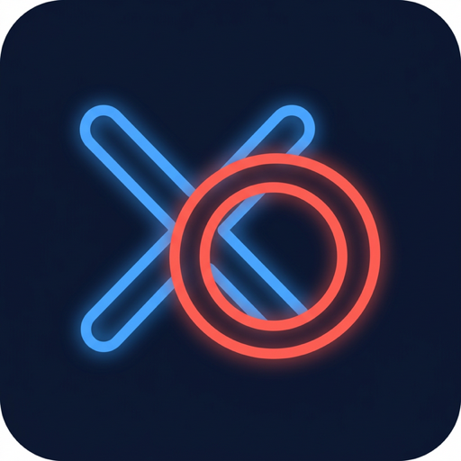
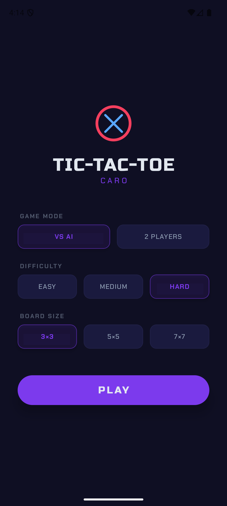
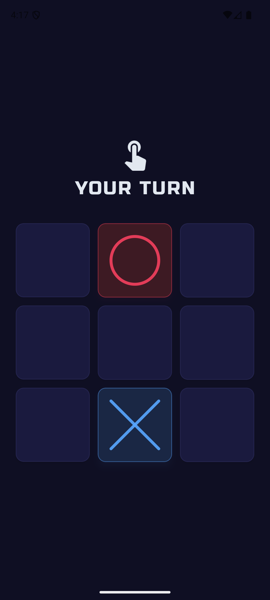

# 🎮 Caro — Tic-Tac-Toe

A beautifully designed, dark-themed Tic-Tac-Toe & Caro board game for Android with premium gaming aesthetics, smart AI opponents, and multiple board sizes.

<p align="center">
  
</p>

<p align="center">
  
  
  
  
  
</p>

---

## ✨ Features

| Feature | Description |
|---------|-------------|
| 🤖 **VS AI** | 3 difficulty levels — Easy, Medium, Hard (minimax algorithm) |
| 👥 **2 Players** | Local multiplayer pass-and-play mode |
| 📐 **Multiple Boards** | Classic 3×3, strategic 5×5, challenging 7×7 |
| 🎯 **Caro Rules** | 5-in-a-row win condition on larger boards |
| 🌙 **Dark Mode** | OLED-optimized deep black (#0F0F23) gaming interface |
| 🎨 **Premium UI** | Neumorphic board, neon glow effects, spring physics animations |
| 📳 **Haptic Feedback** | Tactile response on piece placement and victories |
| 🔤 **Gaming Fonts** | Russo One (headings) + Chakra Petch (body) from Google Fonts |

## 📸 Screenshots

<p align="center">
  
  &nbsp;&nbsp;
  
  &nbsp;&nbsp;
  
</p>

## 🏗️ Architecture

```
com.tructt.caro/
├── domain/                  # Game logic (pure Kotlin, no Android deps)
│   ├── GameEngine.kt        # Minimax AI, win detection, move validation
│   └── GameState.kt         # State models, enums, board config
├── presentation/
│   └── GameViewModel.kt     # UI state management, game flow
├── ui/
│   ├── components/          # Reusable composables
│   │   ├── GameBoard.kt     # Grid layout
│   │   ├── GameCell.kt      # Neumorphic cell with spring animations
│   │   └── LeaveMatchDialog.kt  # Glassmorphism modal
│   ├── screens/
│   │   ├── MenuScreen.kt    # Mode/difficulty/board selection
│   │   └── GameScreen.kt    # Game board + icon-first HUD
│   └── theme/
│       ├── Color.kt         # Gaming color palette
│       └── Theme.kt         # Typography + Material3 theme
└── MainActivity.kt          # Entry point + splash screen
```

## 🛠️ Tech Stack

- **Language**: Kotlin 2.1
- **UI**: Jetpack Compose + Material 3
- **Architecture**: MVVM (ViewModel + StateFlow)
- **AI**: Minimax with alpha-beta pruning
- **Animations**: Spring physics (`DampingRatioMediumBouncy`)
- **Fonts**: Google Fonts (Russo One, Chakra Petch)
- **Splash**: AndroidX SplashScreen API
- **Build**: Gradle Kotlin DSL, R8 minification
- **Deploy**: Gradle Play Publisher (Triple-T)

## 🚀 Getting Started

### Prerequisites
- Android Studio Hedgehog or later
- JDK 17
- Android SDK 35

### Build & Run
```bash
# Debug build
./gradlew assembleDebug

# Install on connected device/emulator
./gradlew installDebug

# Run tests
./gradlew test
```

### Release Build
```bash
# 1. Create keystore.properties from the example
cp keystore.properties.example keystore.properties
# 2. Edit keystore.properties with your signing credentials
# 3. Build signed AAB
./gradlew bundleRelease
```

### Deploy to Play Store
```bash
# Requires service account JSON at ~/.config/play-publisher.json
# See .agents/workflows/deploy.md for full setup guide

./gradlew publishReleaseBundle --track internal    # Internal testing
./gradlew publishReleaseBundle --track production  # Production
```

## 📋 Design System

Powered by [UI UX Pro Max](https://github.com/nextlevelbuilder/ui-ux-pro-max-skill) design intelligence.

| Token | Value | Usage |
|-------|-------|-------|
| Background | `#0F0F23` | OLED-optimized deep black |
| Surface | `#1A1A3E` | Cards, dialogs |
| Blue Accent | `#58A6FF` | Player X, calm/logic |
| Coral Accent | `#F43F5E` | Player O, urgency/compete |
| Purple Accent | `#7C3AED` | CTA, neon glow effects |
| Text Primary | `#E2E8F0` | Main text |
| Text Secondary | `#94A3B8` | Labels, subtitles |

## 📄 License

This project is for personal/educational use.

## 🔗 Links

- [Privacy Policy](https://gist.githubusercontent.com/trucuit/eeea277041251c6358fc0abc6df2fdaf/raw/privacy-policy.html)
- [Google Play Store](https://play.google.com/store/apps/details?id=com.tructt.caro) *(coming soon)*
